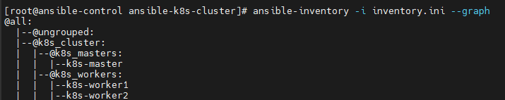
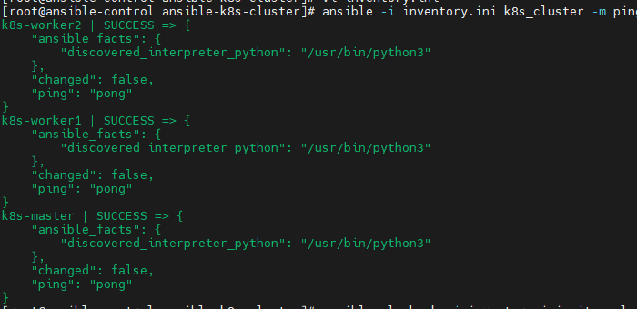
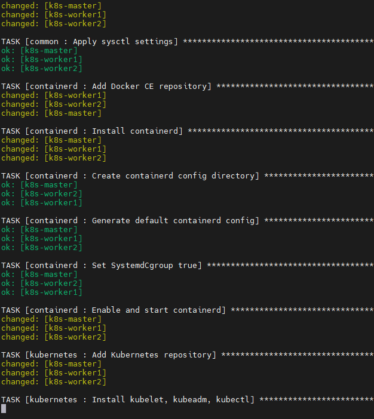
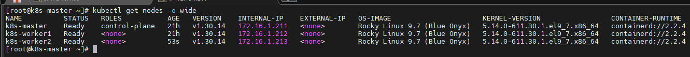
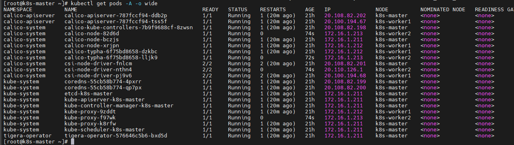

# Ansible 기반 Kubernetes 클러스터 구축 자동화 프로젝트

## 1. 프로젝트 개요

본 프로젝트는 vSphere 환경에서 생성한 Rocky Linux 9 VM들을 대상으로, Ansible Playbook을 이용해 kubeadm 기반 Kubernetes 클러스터를 자동 구축하는 프로젝트입니다.

기존에는 Kubernetes 클러스터를 구성하기 위해 각 노드에 직접 접속하여 swap 비활성화, 커널 모듈 설정, containerd 설치, kubeadm/kubelet/kubectl 설치, master 초기화, worker join, CNI 설치 작업을 수동으로 수행해야 했습니다.

본 프로젝트에서는 이러한 반복 작업을 Ansible Role 단위로 분리하여 자동화했습니다.

```text
수동 구축 방식:
  각 서버에 직접 접속
  명령어를 순서대로 입력
  master init 후 join 명령을 worker에 직접 복사
  Calico CNI 수동 적용

Ansible 자동화 방식:
  inventory에 노드 정보 정의
  ansible-playbook 실행
  전체 노드 공통 설정 자동 적용
  master kubeadm init 자동 수행
  worker kubeadm join 자동 수행
  Calico CNI 자동 설치
```

이를 통해 Kubernetes 클러스터 구축 과정을 표준화하고, 반복 가능한 자동화 환경을 구성하는 것을 목표로 했습니다.

---

## 2. 프로젝트 목표

* vSphere 기반 Rocky Linux VM을 Kubernetes 노드로 구성
* Ansible을 이용한 Kubernetes 클러스터 설치 자동화
* kubeadm 기반 control-plane 초기화 자동화
* worker node join 자동화
* containerd 기반 Container Runtime 구성
* Kubernetes 네트워크 커널 파라미터 자동 설정
* Calico CNI 자동 설치
* 반복 실행을 고려한 멱등성 확보
* 수동 구축 과정에서 발생 가능한 설정 누락 최소화

---

## 3. 인프라 구성

본 프로젝트는 다음과 같은 구조로 구성했습니다.

```text
[vSphere]
    |
    |-- ansible-control
    |       |
    |       | ansible-playbook 실행
    |       v
    |
    |-- k8s-master
    |-- k8s-worker1
    |-- k8s-worker2
```

### VM 구성 예시

| VM 이름           | 역할                       | OS            | 설명              |
| --------------- | ------------------------ | ------------- | --------------- |
| ansible-control | Ansible Control Node     | Rocky-9.5-x86_64-minimal | Ansible 실행 서버   |
| k8s-master      | Kubernetes Control Plane | Rocky-9.5-x86_64-minimal | kubeadm init 수행 |
| k8s-worker1     | Kubernetes Worker Node   | Rocky-9.5-x86_64-minimal | kubeadm join 수행 |
| k8s-worker2     | Kubernetes Worker Node   | Rocky-9.5-x86_64-minimal | kubeadm join 수행 |

---

## 4. 네트워크 구성

각 VM은 동일 네트워크 대역에 배치했습니다.

```text
k8s-master  : 172.16.1.211
k8s-worker1 : 172.16.1.212
k8s-worker2 : 172.16.1.213
```

Ansible inventory에서는 `ansible_host`와 별도로 `node_ip`를 정의했습니다.

```ini
[k8s_masters]
k8s-master ansible_host=172.16.1.211 node_ip=172.16.1.211

[k8s_workers]
k8s-worker1 ansible_host=172.16.1.212 node_ip=172.16.1.212
k8s-worker2 ansible_host=172.16.1.213 node_ip=172.16.1.213
```

`node_ip`를 별도로 둔 이유는 kubelet의 `--node-ip` 옵션에 명시적으로 사용하기 위해서입니다.

VM 환경에서는 여러 NIC, NAT, Host-only, 내부망 대역이 섞일 수 있습니다. 이 경우 kubelet이 노드의 InternalIP를 자동으로 올바르게 감지하지 못할 수 있으므로, Ansible inventory에서 각 노드의 실제 IP를 명시하도록 구성했습니다.

---

## 5. 사용 기술

| 기술            | 설명                                         |
| ------------- | ------------------------------------------ |
| Ansible       | Kubernetes 클러스터 구축 자동화                     |
| kubeadm       | Kubernetes control-plane 초기화 및 worker join |
| kubelet       | Kubernetes Node Agent                      |
| kubectl       | Kubernetes CLI                             |
| containerd    | Container Runtime                          |
| Calico        | Kubernetes CNI Plugin                      |
| Rocky Linux 9 | Kubernetes 노드 OS                           |
| vSphere       | VM 배포 환경                                   |
| systemd       | 서비스 관리                                     |
| firewalld     | 방화벽 서비스                                    |                       
| chrony        | 시간 동기화                                     |

---

## 6. 자동화 범위

| 구분         | 자동화 항목                       |
| ---------- | ---------------------------- |
| 공통 설정      | hostname 설정                  |
| 공통 설정      | `/etc/hosts` 구성              |
| 공통 설정      | timezone 설정                  |
| 공통 설정      | chrony 활성화                   |
| 공통 설정      | firewalld 비활성화               |
| 공통 설정      | swap 비활성화                    |
| 공통 설정      | SELinux permissive 설정        |
| 커널 설정      | overlay, br_netfilter 모듈 로드  |
| 커널 설정      | Kubernetes 네트워크 sysctl 설정    |
| Runtime    | Docker CE repo 추가            |
| Runtime    | containerd 설치                |
| Runtime    | containerd 기본 config 생성      |
| Runtime    | SystemdCgroup 설정             |
| Kubernetes | Kubernetes repo 추가           |
| Kubernetes | kubelet, kubeadm, kubectl 설치 |
| Kubernetes | kubelet node-ip 설정           |
| Master     | kubeadm init                 |
| Master     | kubeconfig 설정                |
| CNI        | Calico manifest 적용           |
| Worker     | kubeadm join 자동 실행           |
| 검증         | nodes, pods 상태 확인            |

---

## 7. 프로젝트 디렉터리 구조

```text
ansible-k8s-cluster/
├── inventory.ini
├── site.yml
├── group_vars/
│   └── all.yml
└── roles/
    ├── common/
    │   └── tasks/
    │       └── main.yml
    ├── containerd/
    │   └── tasks/
    │       └── main.yml
    ├── kubernetes/
    │   └── tasks/
    │       └── main.yml
    ├── master/
    │   └── tasks/
    │       └── main.yml
    ├── cni/
    │   └── tasks/
    │       └── main.yml
    └── worker/
        └── tasks/
            └── main.yml
```

Role은 다음 기준으로 분리했습니다.

| Role       | 설명                             |
| ---------- | ------------------------------ |
| common     | 전체 노드 공통 사전 설정                 |
| containerd | containerd 설치 및 Runtime 설정     |
| kubernetes | Kubernetes 패키지 설치 및 kubelet 설정 |
| master     | control-plane 초기화              |
| cni        | Calico CNI 설치                  |
| worker     | worker node cluster join       |

---

## 8. Inventory 구성

`inventory.ini`

```ini
[k8s_masters]
k8s-master ansible_host=172.16.1.211 node_ip=172.16.1.211

[k8s_workers]
k8s-worker1 ansible_host=172.16.1.212 node_ip=172.16.1.212
k8s-worker2 ansible_host=172.16.1.213 node_ip=172.16.1.213

[k8s_cluster:children]
k8s_masters
k8s_workers

[k8s_cluster:vars]
ansible_user=ansible
ansible_become=true
ansible_become_method=sudo
```

### inventory 확인

```bash
ansible-inventory -i inventory.ini --graph
```

결과:



---

## 9. 변수 파일 구성

`group_vars/all.yml`

```yaml
---
kubernetes_version_repo: "v1.30"
pod_network_cidr: "20.96.0.0/12"

control_plane_endpoint: "172.16.1.211"
apiserver_advertise_address: "172.16.1.211"

k8s_hosts:
  - ip: "172.16.1.211"
    name: "k8s-master"
  - ip: "172.16.1.212"
    name: "k8s-worker1"
  - ip: "172.16.1.213"
    name: "k8s-worker2"

calico_manifest_url: "https://raw.githubusercontent.com/jihwan77/install/main/under-thesea/k8s-cluster-1.30/calico-3.28.2/calico.yaml"
calico_custom_manifest_url: "https://raw.githubusercontent.com/jihwan77/install/main/under-thesea/k8s-cluster-1.30/calico-3.28.2/calico-custom.yaml"

install_dashboard: false
install_metrics_server: false
```

주요 변수 설명:

| 변수                            | 설명                              |
| ----------------------------- | ------------------------------- |
| `kubernetes_version_repo`     | Kubernetes 패키지 repo 버전          |
| `pod_network_cidr`            | Pod Network CIDR                |
| `apiserver_advertise_address` | kube-apiserver가 광고할 IP          |
| `k8s_hosts`                   | 각 노드의 `/etc/hosts` 등록 정보        |
| `calico_manifest_url`         | Calico Operator manifest        |
| `calico_custom_manifest_url`  | Calico Custom Resource manifest |

---

## 10. 메인 Playbook

`site.yml`

```yaml
---
- name: Prepare all Kubernetes nodes
  hosts: k8s_cluster
  become: true
  roles:
    - common
    - containerd
    - kubernetes

- name: Initialize Kubernetes master
  hosts: k8s_masters
  become: true
  roles:
    - master
    - cni

- name: Join Kubernetes workers
  hosts: k8s_workers
  become: true
  roles:
    - worker
```


전체 흐름은 다음과 같습니다.

```text
1. 전체 노드 공통 설정
2. containerd 설치 및 설정
3. kubeadm/kubelet/kubectl 설치
4. master node kubeadm init
5. kubeconfig 설정
6. Calico CNI 설치
7. worker node kubeadm join
8. 클러스터 상태 검증
```


---

## 11. Role 상세 구성

## 11.1 common Role

`roles/common/tasks/main.yml`

```yaml
---
- name: Set timezone to Asia/Seoul
  ansible.builtin.command: timedatectl set-timezone Asia/Seoul
  changed_when: false

- name: Install basic packages
  dnf:
    name:
      - yum-utils
      - iproute-tc
      - curl
      - wget
      - vim
      - bash-completion
      - chrony
    state: present

- name: Enable chronyd
  systemd:
    name: chronyd
    enabled: true
    state: started

- name: Set hostname
  hostname:
    name: "{{ inventory_hostname }}"

- name: Configure /etc/hosts
  blockinfile:
    path: /etc/hosts
    marker: "# {mark} ANSIBLE MANAGED K8S HOSTS"
    block: |
      
      {{ host.ip }} {{ host.name }}
      

- name: Disable firewalld
  systemd:
    name: firewalld
    enabled: false
    state: stopped
  ignore_errors: true

- name: Disable swap immediately
  command: swapoff -a
  changed_when: false

- name: Disable swap permanently in /etc/fstab
  replace:
    path: /etc/fstab
    regexp: '^([^#].*\sswap\s.*)$'
    replace: '# \1'

- name: Set SELinux permissive immediately
  command: setenforce 0
  failed_when: false
  changed_when: false

- name: Set SELinux permissive permanently
  replace:
    path: /etc/selinux/config
    regexp: '^SELINUX=enforcing'
    replace: 'SELINUX=permissive'

- name: Configure kernel modules for Kubernetes
  ansible.builtin.copy:
    dest: /etc/modules-load.d/k8s.conf
    content: |
      overlay
      br_netfilter
    owner: root
    group: root
    mode: '0644'

- name: Load overlay kernel module
  ansible.builtin.command: modprobe overlay
  changed_when: false

- name: Load br_netfilter kernel module
  ansible.builtin.command: modprobe br_netfilter
  changed_when: false

- name: Configure sysctl for Kubernetes networking
  ansible.builtin.copy:
    dest: /etc/sysctl.d/k8s.conf
    content: |
      net.bridge.bridge-nf-call-iptables = 1
      net.bridge.bridge-nf-call-ip6tables = 1
      net.ipv4.ip_forward = 1
    owner: root
    group: root
    mode: '0644'

- name: Apply sysctl settings
  ansible.builtin.command: sysctl --system
  changed_when: false
```

### common Role의 역할

Kubernetes 클러스터 구성 전 모든 노드에 필요한 사전 작업을 수행합니다.

```text
- timezone 설정
- 기본 패키지 설치
- chrony 활성화
- hostname 설정
- /etc/hosts 등록
- firewalld 비활성화
- swap 비활성화
- SELinux permissive 설정
- overlay, br_netfilter 모듈 로드
- Kubernetes 네트워크 sysctl 설정
```

---

## 11.2 containerd Role

`roles/containerd/tasks/main.yml`

```yaml
---
- name: Add Docker CE repository
  command: yum-config-manager --add-repo https://download.docker.com/linux/centos/docker-ce.repo
  args:
    creates: /etc/yum.repos.d/docker-ce.repo

- name: Install containerd
  dnf:
    name: containerd.io
    state: present

- name: Create containerd config directory
  file:
    path: /etc/containerd
    state: directory
    mode: '0755'

- name: Generate default containerd config
  shell: containerd config default > /etc/containerd/config.toml

- name: Set SystemdCgroup true
  shell: sed -i 's/SystemdCgroup = false/SystemdCgroup = true/' /etc/containerd/config.toml

- name: Enable and restart containerd
  systemd:
    name: containerd
    enabled: true
    state: restarted
    daemon_reload: true
```

### containerd Role의 핵심

Kubernetes에서 사용할 Container Runtime으로 containerd를 설치하고 설정합니다.

특히 중요한 설정은 다음입니다.

```toml
SystemdCgroup = true
```

Kubernetes 환경에서는 kubelet과 container runtime의 cgroup driver를 systemd 기준으로 맞추는 것이 중요합니다.

또한 기존 containerd 설정에 `disabled_plugins = ["cri"]`가 남아 있으면 Kubernetes가 containerd와 CRI 통신을 할 수 없으므로, 기본 설정을 다시 생성하고 containerd를 재시작하도록 구성했습니다.

---

## 11.3 kubernetes Role

`roles/kubernetes/tasks/main.yml`

```yaml
---
- name: Add Kubernetes repository
  copy:
    dest: /etc/yum.repos.d/kubernetes.repo
    content: |
      [kubernetes]
      name=Kubernetes
      baseurl=https://pkgs.k8s.io/core:/stable:/{{ kubernetes_version_repo }}/rpm/
      enabled=1
      gpgcheck=1
      gpgkey=https://pkgs.k8s.io/core:/stable:/{{ kubernetes_version_repo }}/rpm/repodata/repomd.xml.key
      exclude=kubelet kubeadm kubectl cri-tools kubernetes-cni

- name: Install kubelet, kubeadm, kubectl
  dnf:
    name:
      - kubelet
      - kubeadm
      - kubectl
    state: present
    disable_excludes: kubernetes

- name: Configure kubelet node IP
  copy:
    dest: /etc/sysconfig/kubelet
    content: |
      KUBELET_EXTRA_ARGS=--node-ip={{ node_ip | default(ansible_host) }}
    mode: '0644'

- name: Restart and enable kubelet
  systemd:
    name: kubelet
    enabled: true
    state: restarted
    daemon_reload: true
```

### kubernetes Role의 역할

각 노드에 Kubernetes 패키지를 설치하고 kubelet 설정을 구성합니다.

특히 `/etc/sysconfig/kubelet`에 다음 설정을 넣어 각 노드의 InternalIP를 명시했습니다.

```bash
KUBELET_EXTRA_ARGS=--node-ip={{ node_ip | default(ansible_host) }}
```

이 설정을 통해 `kubectl get nodes -o wide`에서 INTERNAL-IP가 `<none>`으로 표시되는 문제를 방지했습니다.

---

## 11.4 master Role

`roles/master/tasks/main.yml`

```yaml
---
- name: Check if Kubernetes control plane is already initialized
  stat:
    path: /etc/kubernetes/admin.conf
  register: kubeadm_init_status

- name: Initialize Kubernetes control plane
  command: >
    kubeadm init
    --pod-network-cidr={{ pod_network_cidr }}
    --apiserver-advertise-address={{ apiserver_advertise_address }}
  when: not kubeadm_init_status.stat.exists

- name: Create .kube directory for ansible user
  file:
    path: /home/ansible/.kube
    state: directory
    owner: ansible
    group: ansible
    mode: '0755'

- name: Copy admin.conf to ansible user kubeconfig
  copy:
    src: /etc/kubernetes/admin.conf
    dest: /home/ansible/.kube/config
    remote_src: true
    owner: ansible
    group: ansible
    mode: '0600'

- name: Create .kube directory for root
  file:
    path: /root/.kube
    state: directory
    mode: '0755'

- name: Copy admin.conf to root kubeconfig
  copy:
    src: /etc/kubernetes/admin.conf
    dest: /root/.kube/config
    remote_src: true
    mode: '0600'

- name: Enable kubectl autocomplete and alias for ansible user
  blockinfile:
    path: /home/ansible/.bashrc
    marker: "# {mark} ANSIBLE MANAGED KUBECTL"
    block: |
      source <(kubectl completion bash)
      alias k=kubectl
      complete -o default -F __start_kubectl k
    create: true
    owner: ansible
    group: ansible
```

### master Role의 핵심

master Role에서는 `kubeadm init`을 통해 control-plane을 초기화합니다.

중요한 점은 다음 파일의 존재 여부를 확인한다는 것입니다.

```text
/etc/kubernetes/admin.conf
```

이 파일이 존재하면 이미 Kubernetes control-plane이 초기화된 상태이므로, `kubeadm init`을 다시 실행하지 않도록 구성했습니다.

```yaml
when: not kubeadm_init_status.stat.exists
```

이를 통해 Playbook을 반복 실행했을 때 control-plane을 다시 초기화하는 문제를 방지했습니다.

---

## 11.5 cni Role

`roles/cni/tasks/main.yml`

```yaml
---
- name: Check if Calico namespace exists
  command: kubectl get namespace calico-system
  environment:
    KUBECONFIG: /etc/kubernetes/admin.conf
  register: calico_ns
  failed_when: false
  changed_when: false

- name: Install Calico manifest
  command: >
    kubectl apply --server-side --force-conflicts
    -f {{ calico_manifest_url }}
  environment:
    KUBECONFIG: /etc/kubernetes/admin.conf
  when: calico_ns.rc != 0

- name: Install Calico custom manifest
  command: >
    kubectl apply --server-side --force-conflicts
    -f {{ calico_custom_manifest_url }}
  environment:
    KUBECONFIG: /etc/kubernetes/admin.conf
  when: calico_ns.rc != 0
```

### cni Role의 역할

Kubernetes 클러스터의 Pod Network 구성을 위해 Calico CNI를 설치합니다.

Calico는 다음 두 단계로 설치했습니다.

```text
1. Calico Operator manifest 적용
2. Calico Custom Resource manifest 적용
```

Calico CRD는 YAML 크기가 크기 때문에 일반 `kubectl apply -f` 대신 다음 방식을 사용했습니다.

```bash
kubectl apply --server-side --force-conflicts -f <manifest>
```

이를 통해 `metadata.annotations: Too long` 오류를 방지했습니다.

---

## 11.6 worker Role

`roles/worker/tasks/main.yml`

```yaml
---
- name: Check if worker already joined
  stat:
    path: /etc/kubernetes/kubelet.conf
  register: worker_join_status

- name: Get kubeadm join command from master
  command: kubeadm token create --print-join-command
  delegate_to: "{{ groups['k8s_masters'][0] }}"
  register: join_command
  when: not worker_join_status.stat.exists

- name: Join worker node to Kubernetes cluster
  command: "{{ join_command.stdout }} --node-name {{ inventory_hostname }}"
  when: not worker_join_status.stat.exists
```

### worker Role의 핵심

수동 구축에서는 master에서 다음 명령을 실행해 join 명령어를 확인한 뒤, worker 노드에서 직접 실행해야 합니다.

```bash
kubeadm token create --print-join-command
```

Ansible에서는 이 과정을 자동화했습니다.

```text
1. worker가 이미 join 되었는지 확인
2. master 노드에서 join command 생성
3. worker 노드에서 join command 실행
```

worker 노드의 `/etc/kubernetes/kubelet.conf` 파일이 존재하면 이미 클러스터에 join된 것으로 판단하고 join 명령을 다시 실행하지 않습니다.

---

## 12. 실행 방법

### 12.1 프로젝트 디렉터리 생성

```bash
mkdir -p /root/ansible-k8s-cluster
cd /root/ansible-k8s-cluster
```

### 12.2 Ansible 연결 확인

```bash
ansible -i inventory.ini k8s_cluster -m ping
```

결과:



### 12.3 Playbook 실행

```bash
ansible-playbook -i inventory.ini site.yml
```



### 12.4 클러스터 상태 확인

master 노드에서 확인합니다.

```bash
kubectl get nodes -o wide
kubectl get pods -A -o wide
```

---

## 13. 자동화 성공 기준

### 13.1 Node 상태 확인

```bash
kubectl get nodes -o wide
```

결과:




### 13.2 전체 Pod 상태 확인

```bash
kubectl get pods -A -o wide
```

결과:



---

## 14. vSphere Template과 Ansible 역할 분리

본 프로젝트에서는 vSphere Template과 Ansible의 역할을 다음과 같이 분리하는 방향으로 설계했습니다.

### 14.1 vSphere Template 단계

Template에는 OS 공통 설정과 Ansible이 접속하기 위한 최소 조건만 포함합니다.

```text
- Rocky Linux 9 설치
- SSH 활성화
- ansible 계정 생성
- ansible sudo NOPASSWD 설정
- SSH Key 등록
- open-vm-tools 설치
- 기본 패키지 설치
- machine-id 초기화
- Template 변환
```

### 14.2 vSphere Clone 단계

vSphere에서는 Template을 기반으로 Kubernetes 노드 VM을 생성합니다.

```text
- k8s-master VM 생성
- k8s-worker1 VM 생성
- k8s-worker2 VM 생성
- CPU/RAM/Disk/NIC 설정
- IP/hostname 부여
```

### 14.3 Ansible 단계

Ansible은 Kubernetes 클러스터 구축에 필요한 설정을 담당합니다.

```text
- 전체 노드 공통 설정
- containerd 설치
- containerd SystemdCgroup 설정
- Kubernetes repo 설정
- kubeadm/kubelet/kubectl 설치
- kubelet node-ip 설정
- master kubeadm init
- kubeconfig 설정
- Calico 설치
- worker join
- 클러스터 검증
```

이렇게 역할을 분리하면 Template은 범용 Linux 기본 이미지로 유지할 수 있고, Kubernetes 관련 설정은 Ansible Playbook으로 버전 관리하며 반복적으로 적용할 수 있습니다.

---

## 15. 프로젝트 아키텍처

```text
[User]
   |
   v
[ansible-control]
   |
   | ansible-playbook -i inventory.ini site.yml
   v

[vSphere VM Nodes]
├── k8s-master
│   ├── hostname 설정
│   ├── /etc/hosts 설정
│   ├── swap off
│   ├── SELinux permissive
│   ├── firewalld disable
│   ├── kernel module/sysctl 설정
│   ├── containerd 설치
│   ├── kubeadm/kubelet/kubectl 설치
│   ├── kubelet node-ip 설정
│   ├── kubeadm init
│   ├── kubeconfig 설정
│   ├── Calico 설치
│   └── join command 발급
│
├── k8s-worker1
│   ├── hostname 설정
│   ├── /etc/hosts 설정
│   ├── swap off
│   ├── SELinux permissive
│   ├── firewalld disable
│   ├── kernel module/sysctl 설정
│   ├── containerd 설치
│   ├── kubeadm/kubelet/kubectl 설치
│   ├── kubelet node-ip 설정
│   └── kubeadm join
│
└── k8s-worker2
    ├── hostname 설정
    ├── /etc/hosts 설정
    ├── swap off
    ├── SELinux permissive
    ├── firewalld disable
    ├── kernel module/sysctl 설정
    ├── containerd 설치
    ├── kubeadm/kubelet/kubectl 설치
    ├── kubelet node-ip 설정
    └── kubeadm join
```

---

## 16. 트러블슈팅

## 16.1 containerd CRI 비활성화로 인한 kubeadm init 실패

### 문제 현상

master 노드에서 `kubeadm init` 단계가 실패했습니다.

```text
[ERROR CRI]: container runtime is not running
validate CRI v1 runtime API for endpoint "unix:///var/run/containerd/containerd.sock"
rpc error: code = Unimplemented desc = unknown service runtime.v1.RuntimeService
```

### 원인

`/etc/containerd/config.toml` 파일에 다음 설정이 남아 있었습니다.

```toml
disabled_plugins = ["cri"]
```

이 설정은 containerd의 CRI 플러그인을 비활성화합니다. Kubernetes는 kubelet이 container runtime과 통신할 때 CRI를 사용하므로, CRI가 비활성화되어 있으면 `kubeadm init`이 실패합니다.

또한 Ansible task에 다음 옵션이 들어가 있으면 문제가 될 수 있습니다.

```yaml
args:
  creates: /etc/containerd/config.toml
```

`creates` 옵션은 해당 파일이 이미 존재하면 명령을 실행하지 않습니다. 기존의 잘못된 `config.toml`이 남아 있으면 기본 설정이 다시 생성되지 않아 문제가 계속 발생합니다.

### 해결 방법

containerd 기본 설정을 강제로 다시 생성하도록 수정했습니다.

```yaml
- name: Generate default containerd config
  shell: containerd config default > /etc/containerd/config.toml
```

그리고 `SystemdCgroup`을 `true`로 변경했습니다.

```yaml
- name: Set SystemdCgroup true
  shell: sed -i 's/SystemdCgroup = false/SystemdCgroup = true/' /etc/containerd/config.toml
```

containerd도 반드시 재시작하도록 구성했습니다.

```yaml
- name: Enable and restart containerd
  systemd:
    name: containerd
    enabled: true
    state: restarted
    daemon_reload: true
```

### 확인 명령어

```bash
grep -n "disabled_plugins" /etc/containerd/config.toml
grep -n "SystemdCgroup" /etc/containerd/config.toml
crictl info
```

정상 예시:

```toml
disabled_plugins = []
SystemdCgroup = true
```

---

## 16.2 Calico 설치 중 annotation 크기 제한 오류

### 문제 현상

Calico manifest를 적용하는 과정에서 다음 오류가 발생했습니다.

```text
metadata.annotations: Too long: must have at most 262144 bytes
```

### 원인

일반 `kubectl apply -f`는 리소스에 다음 annotation을 저장합니다.

```text
kubectl.kubernetes.io/last-applied-configuration
```

Calico/Tigera의 CRD는 YAML 내용이 크기 때문에 전체 내용을 annotation에 저장하려다가 Kubernetes annotation 크기 제한을 초과했습니다.

### 해결 방법

일반 `kubectl apply -f` 대신 server-side apply를 사용했습니다.

```bash
kubectl apply --server-side --force-conflicts -f calico.yaml
```

Ansible task도 다음과 같이 수정했습니다.

```yaml
- name: Install Calico manifest
  command: >
    kubectl apply --server-side --force-conflicts
    -f {{ calico_manifest_url }}
  environment:
    KUBECONFIG: /etc/kubernetes/admin.conf
```

Calico custom resource도 동일하게 적용했습니다.

```yaml
- name: Install Calico custom manifest
  command: >
    kubectl apply --server-side --force-conflicts
    -f {{ calico_custom_manifest_url }}
  environment:
    KUBECONFIG: /etc/kubernetes/admin.conf
```

---


## 16.3 Tigera Operator만 실행되고 Calico Pod가 생성되지 않음

### 문제 현상

`tigera-operator`는 Running 상태였지만 `calico-system` namespace와 `calico-node` Pod가 생성되지 않았습니다.

확인된 상태:

```text
tigera-operator   tigera-operator-xxxxx   1/1 Running
```

하지만 다음 리소스는 보이지 않았습니다.

```text
calico-system
calico-node
calico-kube-controllers
```

### 원인

Calico 설치는 다음 순서로 진행됩니다.

```text
1. Tigera Operator 설치
2. Installation/default, APIServer/default Custom Resource 생성
3. Operator가 calico-system namespace와 calico-node 등을 생성
```

첫 번째 manifest만 적용되었거나 custom manifest 적용이 실패하면 Operator만 실행되고 Calico 본체는 생성되지 않을 수 있습니다.

### 확인 명령어

```bash
kubectl get ns
kubectl get installation
kubectl describe installation default
kubectl get tigerastatus
kubectl get events -A --sort-by=.lastTimestamp | tail -50
kubectl logs -n tigera-operator deploy/tigera-operator
```

### 해결 방법

Calico operator manifest와 custom manifest를 모두 적용했습니다.

```bash
kubectl apply --server-side --force-conflicts -f <calico_manifest_url>
kubectl apply --server-side --force-conflicts -f <calico_custom_manifest_url>
```

---

## 16.4 kubectl logs 실패: no preferred addresses found

### 문제 현상

Pod 로그를 확인하려고 하면 다음 에러가 발생했습니다.

```text
Error from server: no preferred addresses found; known addresses: []
```

### 원인

Kubernetes Node 객체에 `InternalIP`가 등록되지 않았습니다.

확인 명령:

```bash
kubectl get nodes -o wide
```

문제 상태:

```text
NAME         STATUS   ROLES           INTERNAL-IP
k8s-master   Ready    control-plane    <none>
```

Kubernetes API Server가 Pod 로그를 가져오려면 해당 Pod가 실행 중인 노드의 kubelet에 접근해야 합니다.
그런데 Node 객체에 InternalIP가 없으면 API Server가 kubelet에 접근할 주소를 알 수 없어 로그 조회가 실패합니다.

### 해결 방법

kubelet에 node IP를 명시적으로 지정했습니다.

```bash
echo 'KUBELET_EXTRA_ARGS=--node-ip=172.16.1.211' > /etc/sysconfig/kubelet
systemctl daemon-reload
systemctl restart kubelet
```

Ansible에서는 다음과 같이 구성했습니다.

```yaml
- name: Configure kubelet node IP
  copy:
    dest: /etc/sysconfig/kubelet
    content: |
      KUBELET_EXTRA_ARGS=--node-ip={{ node_ip | default(ansible_host) }}
    mode: '0644'

- name: Restart and enable kubelet
  systemd:
    name: kubelet
    enabled: true
    state: restarted
    daemon_reload: true
```

해결 후 확인:

```bash
kubectl get nodes -o wide
```

정상 상태:

```text
NAME         STATUS   ROLES           INTERNAL-IP
k8s-master   Ready    control-plane    172.16.1.211
```


---


### apiserver_advertise_address와 node_ip의 차이

`kubeadm init`에서 사용하는 옵션:

```bash
--apiserver-advertise-address=172.16.1.211
```

이 값은 kube-apiserver가 사용할 IP를 의미합니다.

반면 kubelet의 `--node-ip`는 각 노드가 Kubernetes Node 객체에 등록할 InternalIP를 의미합니다.

```bash
KUBELET_EXTRA_ARGS=--node-ip=172.16.1.211
```

즉, 두 설정은 역할이 다릅니다.

```text
--apiserver-advertise-address
  → kube-apiserver가 자신을 광고할 IP

--node-ip
  → kubelet이 Node 객체에 등록할 InternalIP
```

따라서 `--apiserver-advertise-address`를 지정했다고 해서 `kubectl get nodes -o wide`의 `INTERNAL-IP`가 자동으로 채워지는 것은 아닙니다.


---


## 17. 향후 개선 방향

현재 프로젝트는 kubeadm 기반 Kubernetes 클러스터 구축 자동화에 집중했습니다.
향후에는 다음 기능을 추가하여 더 운영 환경에 가까운 형태로 확장할 수 있습니다.

### 17.1 Kubernetes Add-on 자동화

```text
- Metrics Server
- Kubernetes Dashboard
- MetalLB
- Ingress NGINX Controller
- Prometheus / Grafana
```

### 17.2 고가용성 Control Plane 구성

```text
- 3 Master Node 구성
- HAProxy 또는 Keepalived 기반 API Server Endpoint 구성
- controlPlaneEndpoint 사용
```

### 17.3 Ansible 구조 개선

```text
- handlers 분리
- templates 디렉터리 사용
- ansible-lint 적용
- Molecule 테스트 적용
- vars 파일 환경별 분리
```

### 17.4 vSphere 자동화 연동

```text
- vSphere Template 기반 VM 배포
- Terraform을 이용한 VM 생성 자동화
- Ansible과 Terraform 연계
```

---

## 18. 프로젝트를 통해 학습한 내용

### 18.1 Kubernetes 수동 구축 절차의 자동화

수동으로 입력하던 kubeadm 기반 클러스터 구축 명령을 Ansible Role로 분리하여 자동화했습니다.

### 18.2 Ansible Role 구조 설계

공통 설정, container runtime, Kubernetes 설치, master 초기화, CNI 설치, worker join을 Role 단위로 나누어 유지보수성을 높였습니다.

### 18.3 Kubernetes 구성 순서의 중요성

Kubernetes는 설치 순서가 중요합니다.

```text
swap off
→ kernel module/sysctl 설정
→ container runtime 설치
→ kubelet/kubeadm/kubectl 설치
→ kubeadm init
→ CNI 설치
→ worker join
```

순서가 잘못되거나 설정이 누락되면 kubeadm init, worker join, CNI 구성이 실패할 수 있음을 확인했습니다.

### 18.4 자동화에서의 멱등성 고려

`admin.conf`, `kubelet.conf`, Calico namespace 존재 여부를 확인하여 이미 구성된 작업을 반복 실행하지 않도록 구성했습니다.

### 18.5 VM 환경에서의 node-ip 명시 필요성

vSphere 기반 VM 환경에서는 kubelet이 InternalIP를 자동 감지하지 못할 수 있습니다.
자동화에서는 `node_ip` 변수를 inventory에 명시하고 kubelet에 직접 반영하는 방식이 더 안정적임을 확인했습니다.

---

## 관련 문서

 문서 | 설명 |
|---|---|
|  [vSphere Template 및 사용자 지정 규칙 생성](https://app.notion.com/p/Template-Customization-Specification-30c65bdd009e8046bf8ef2678b0dd676?source=copy_link) | vSphere를 통한 VM Template 생성 및 Customization Specification 생성 |
|  [ansible을 이용한 linux 자동화](https://github.com/jihwan77/Ansible-Linux-Automation) | 현재 프로젝트에 기반이 되는 linux 자동화 프로젝트 |

